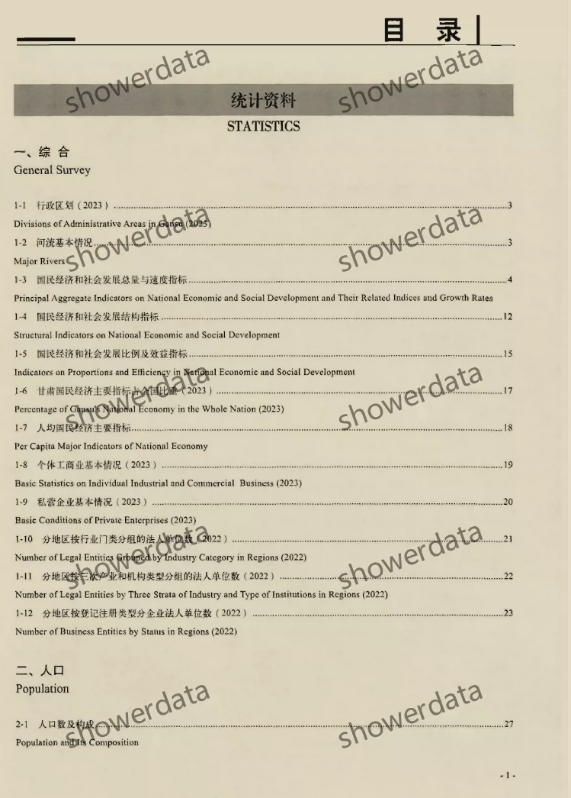
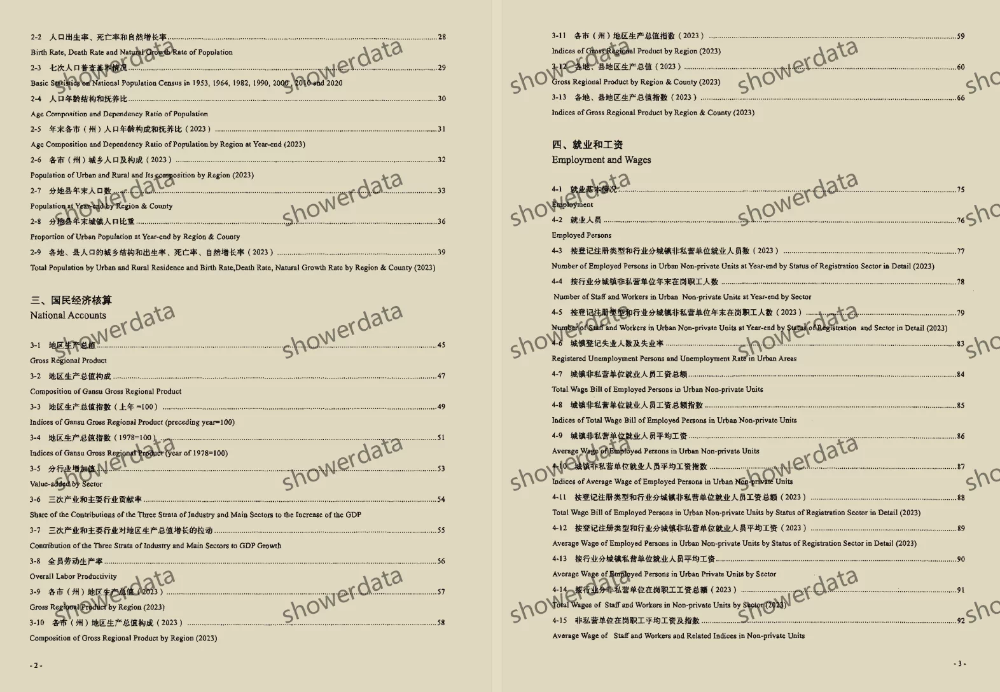
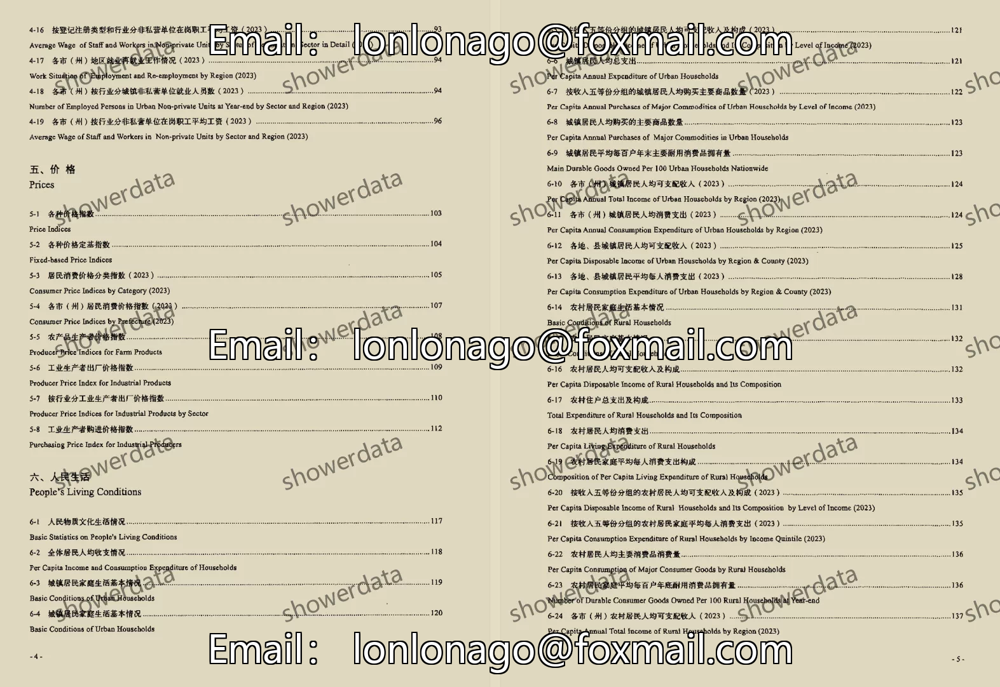
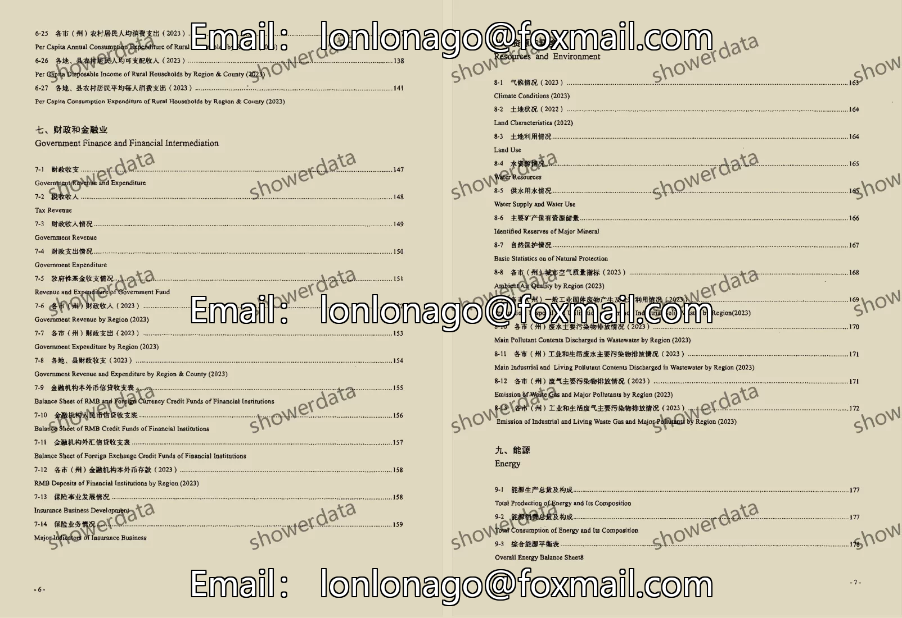
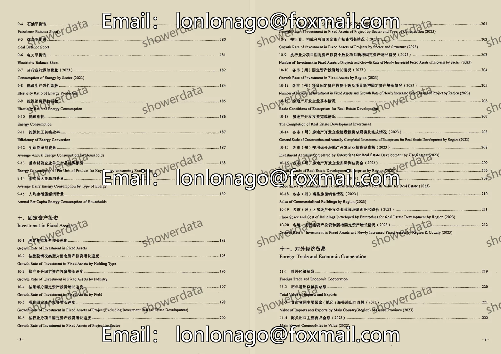
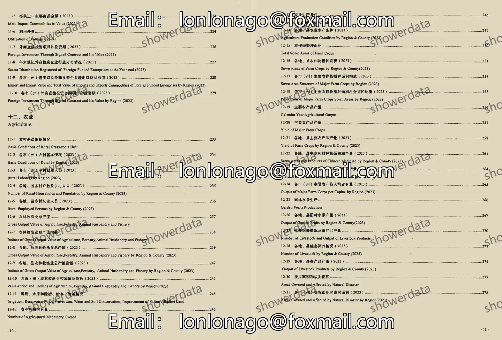
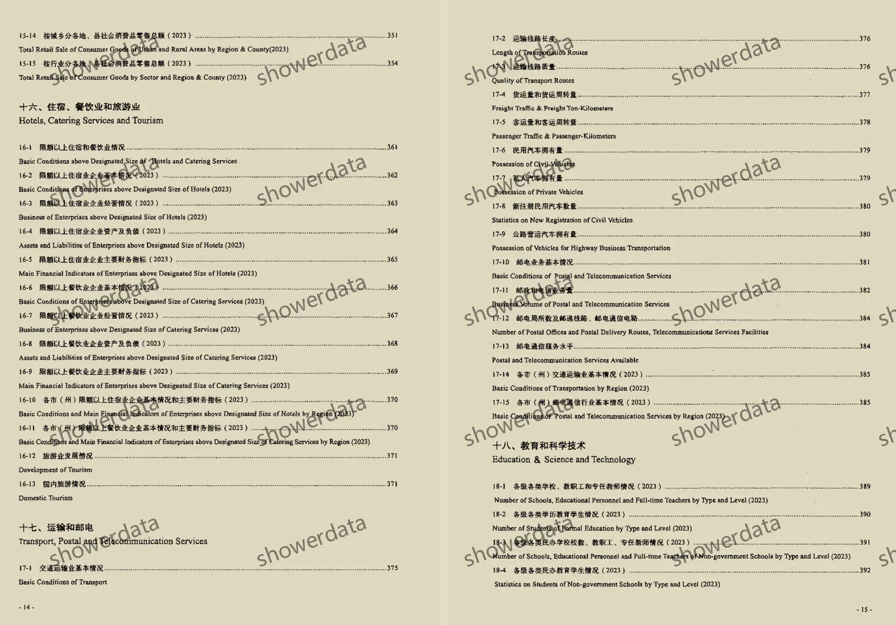

## Body

"Gansu Statistical Yearbook" (1984-2025)

Data Year: The title year of the data compilation is the year of publication, and the data year should be one less than this.
Please see the image below for a complete display of the description. Before purchasing, make sure to read it carefully! After the item is shipped, there will be no returns or exchanges under any reason!

01. Data Introduction
The "Gansu Statistical Yearbook" is a statistical yearbook of Gansu. It was published in the years 1984-1993 as "Gansu Statistical Yearbook", in the years 1994-2009 as "Gansu Yearbook", in the years 2010-2023 as "Gansu Development Yearbook", and from 2024 onwards has been renamed "Gansu Statistical Yearbook". Please note.

02. Index Details
(1) The index is displayed in the image, please view it on your own and purchase accordingly. There are many indicators, so if you need help finding them, they are all here. After shipping, we do not support unreasonable returns.
(2) The display index is for the year 2024, due to limited space only some parts are shown. The statistical criteria may change from year to year. Academic common sense, the data recorded in statistical materials is the data from the previous year, which is also common knowledge in academia. Please be aware of this.
(3) The Excel format data is organized from original materials, including the content of the original material data but not the text content.
(4) If the data is placed in a zip file, you need to save the zip file first before downloading and unzipping.
(5) If there is Excel protection, you can select all and copy to a new sheet to use.

03. Data Format
Pdf and Excel versions are available, with only CD-ROM and Excel versions available for 2025.

## Images

Here is a pay link on Stripe ( https://buy.stripe.com/3cs8yP7sY87d0vu9AB ). Please contact me lonlonago@foxmail.com after funding $89, and I will send you a complete data files , thank you!

